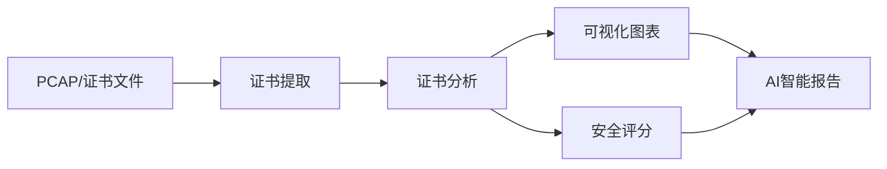

# 数字证书安全分析系统 (Digital Certificate Security Analysis System)

<div align="center">
  
[](https://github.com/yourusername/cert-security-analysis)
[](https://www.python.org/)
[](https://flask.palletsprojects.com/)
[](LICENSE)
[](https://github.com/yourusername/cert-security-analysis/pulls)

**一个专业的TLS/SSL证书链分析与安全评估平台 · 网络通信安全的"守护者"**

[功能特性](#-核心特性) •
[系统架构](#-系统架构) •
[使用指南](#-使用指南) •
[贡献](#-贡献)

</div>

---

## 一、项目背景

数字证书安全分析系统是一个专注于TLS/SSL证书链分析与安全评估的专业平台。随着企业服务器规模的扩张与网络环境的复杂化，服务器证书链的结构合理性、属性合规性及健康状态管理面临诸多挑战——证书过期导致服务中断、中间证书缺失引发信任链断裂、弱签名算法带来加密风险等。

本系统通过系统化分析网络抓包文件中的TLS/SSL握手数据，提取并评估服务器证书链的关键属性，生成量化指标，揭示安全性、合规性及运营效率特征，为识别安全风险、优化证书管理策略提供关键技术支撑。

## 二、核心特性

###  多维分析能力

| 特性 | 描述 | 支持格式 |
|------|------|----------|
| **PCAP抓包分析** | 从网络抓包文件中提取TLS/SSL证书 | .pcap, .pcapng |
| **批量证书处理** | 支持单个/批量证书文件分析 | .cer, .crt, .pem, .der |
| **压缩包分析** | 自动解压并分析压缩包中的证书 | .zip, .rar, .7z |

###  安全检测维度

- **HTTPS强制重定向检测** - 检查HTTP到HTTPS的自动跳转配置
- **HSTS策略评估** - 分析HTTP Strict Transport Security配置
- **安全响应头检查** - CSP、X-Frame-Options、X-Content-Type-Options等
- **证书链完整性验证** - 从终端证书到根证书的完整信任链
- **加密算法强度分析** - RSA/ECC密钥长度、签名算法评估

###  可视化与报告

-  证书有效期分布图
-  颁发机构分布图
-  密码学强度分布图
-  AI智能分析报告（基于DeepSeek API）

## 三、系统架构

### 项目结构
```bash
cert-security-analysis/
├── app.py # 主应用入口
├── batch_process_pcaps.py # PCAP批量处理脚本
├── certificate_chain_validator.py # 证书链完整性验证
├── certificate_fetcher.py # 域名证书获取
├── certificate_filter.py # PCAP证书提取
├── certificate_validity_analyzer.py # 证书有效性分析
├── http_security_checker.py # HTTP安全头检查
├── requirements.txt # 项目依赖
├── .env.example # 环境变量示例
├── README.md # 项目文档
├── LICENSE # 许可证文件
│
├── routes/ # 路由模块
│ ├── main_routes.py # 主页面路由
│ ├── cert_routes.py # 证书分析路由
│ ├── security_routes.py # 安全分析路由
│ └── report_routes.py # 报告生成路由
│
├── services/ # 业务逻辑服务
│ ├── task_queue.py # 任务队列系统
│ └── deepseek_service.py # DeepSeek API服务
│
├── utils/ # 工具函数
│ ├── logging_utils.py # 日志配置
│ ├── file_utils.py # 文件处理
│ ├── report_utils.py # 报告生成
│ └── security_utils.py # 安全分析工具
│
├── static/ # 静态资源
│ ├── css/ # 样式文件
│ ├── js/ # JavaScript文件
│ ├── images/ # 图片资源
│ └── webfonts/ # 字体文件
│
└── templates/ # 页面模板
├── index.html # 主页
├── cert_analysis.html # 证书分析页
├── security_analysis.html # 安全分析页
└── system_intro.html # 系统介绍页
```


### 工作流程



## 四、 使用指南

### 环境要求
Python: 3.8 或更高版本

操作系统: Windows 10/11, Linux, macOS

内存: 建议 4GB 以上

磁盘空间: 建议 1GB 以上

### 安装步骤
方法一：使用 Python 原生虚拟环境
```bash
# 1. 克隆项目
git clone https://github.com/yourusername/cert-security-analysis.git
cd cert-security-analysis

# 2. 创建虚拟环境
python -m venv venv

# 3. 激活虚拟环境
# Windows
venv\Scripts\activate
# Linux/macOS
source venv/bin/activate

# 4. 安装依赖
pip install -r requirements.txt

# 5. 启动应用
python app.py
```

方法二：使用 Conda（推荐）
```bash
# 1. 克隆项目
git clone https://github.com/yourusername/cert-security-analysis.git
cd cert-security-analysis

# 2. 创建Conda环境
conda create -n cert-analysis python=3.10 -y

# 3. 激活环境
conda activate cert-analysis

# 4. 安装依赖
pip install -r requirements.txt

# 5. 启动应用
python app.py
```

### 环境配置
创建 .env 文件（可选）：

```bash
# Flask配置
SECRET_KEY=your-secret-key-here
ENV=development  # 或 production

# DeepSeek API配置（如需AI报告功能）
DEEPSEEK_API_KEY=your-api-key-here
DEEPSEEK_API_URL=https://api.deepseek.com/chat/completions
访问 http://localhost:5000 即可使用系统。
```

## 五、贡献指南
**欢迎贡献代码、报告问题或提出新功能建议！**

### 贡献流程
Fork 本仓库

创建您的特性分支 (git checkout -b feature/AmazingFeature)

提交您的更改 (git commit -m 'Add some AmazingFeature')

推送到分支 (git push origin feature/AmazingFeature)

打开一个 Pull Request

### 开发规范
代码遵循 PEP 8 规范

添加适当的注释和文档

保持代码简洁易懂

添加单元测试（如适用）

## 六、许可证
本项目采用 MIT 许可证 - 详见 LICENSE 文件
Copyright (c) 2026 junmo

## 七、 致谢
感谢所有贡献者的辛勤付出！

<div align="center">
如果这个项目对您有帮助，请给个⭐️Star吧！


</div> 
